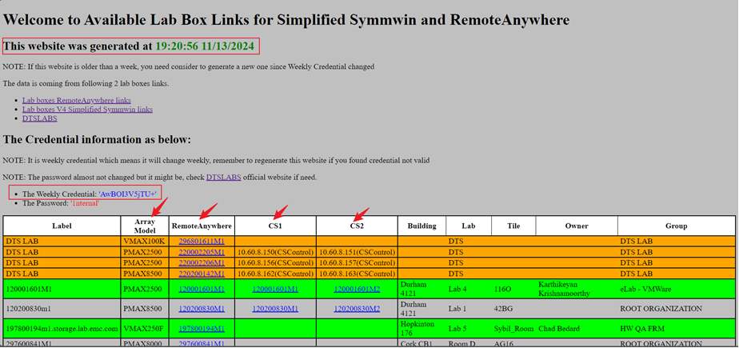
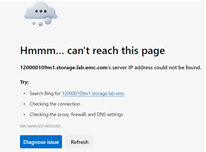
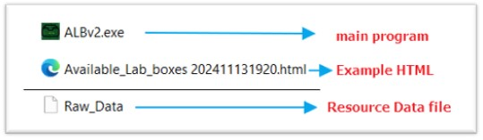
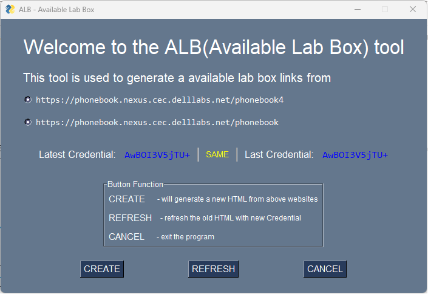

<!--
 * @Author: peanutfisher meifajia@outlook.com
 * @Date: 2024-11-14 13:25:19
 * @LastEditors: peanutfisher meifajia@outlook.com
 * @LastEditTime: 2024-11-14 13:29:41
 * @FilePath: \AvailableLabBox\ALBv2\Readme.md
-->
INTERNAL USE ONLY

I have made a tool called ALB, full name as Available Lab Box, which intended to generate a HTML for the Remote Anywhere ,Simplified Symmwin links for ALL available lab box links for our Symmetrix Support Team.

The HTML output would be like:
-	HTML created timestamp
-	Current Credential
-	Array models (Ctrl+F to find the array model you want)
-	Remote Anywhere Links(For both V3 and V4)
-	Simplified Symmwin Links(For only V4)
-	1 V3 and 3 V4 boxes from DTS lab (Please use AutoBook to use those boxes from  Dell Technologies Services Labs(DTS Labs))
    
 

What is the data source for the HTML?
>> It collects data from following links:
-	Lab boxes RemoteAnywhere links
-	Lab boxes V4 Simplified Symmwin links
-	DTSLABS

Why this tool to be created?
>> Here are some pain points:
-	Using DTS Lab to do AutoBook, you have to get IP/Credential/RemoteAnywhere link formats from different websites… which is not convenient.
-	There are many DEAD links in the Lab boxes RemoteAnywhere and V4 simplified Simmwin, you must try some more links to get an available one.

 
-	When you have some unfamiliar INLINES, either from Documents or LKB, want to test before typing in customer’s box, you are always trying to find a same/similar Type and Colde Level box for it…but it is hard to find one…

How to use this tool?
>> Easy to use 😊
1.	APP files:  
    

2.	After clicking the EXE file, you will get following:
    

a)	The CREATE button will generate a FRESH new HTML from the web links and the ‘Raw_Data’ file will also be updated. NOTE: This progress will take about 2 hours to complete as there are 1180+ links…

b)	The REFRESH button will refresh the existing HTML with latest credentials if it is available. NOTE: it bases on the data from ‘Raw_Data’.

c)	The Latest Credential will be collected from web links automatically when you start the program.

d)	The Last Credential will be collected from the ‘Raw_Data’ file if it exists.

e)	The Compare result will show in middle, ‘SAME’ means no need to do anything, ‘NOT SAME’ means the Credential changed, you can either REFRESH(fast) the existing HTML or CREATE(slow) to get a fresh one. 

f)	Either CREATE or REFRESH will finally generate a HTML name with ‘Available_Lab_boxes YYMMDD HHMM.html’ in your program folder, pick up the latest one to use.

g)	We’d recommend doing REFRESH if Latest Credential changed… 

I will look forward to your feedback.
>> Anything about usage, problems, bugs and suggestions, please feel free to reach me. 

