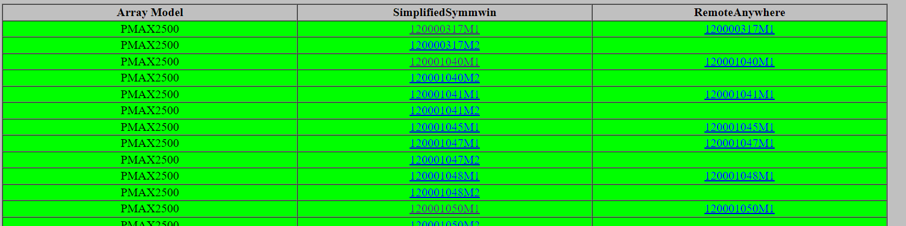

<!--
 * @Author: peanutfisher meifajia@outlook.com
 * @Date: 2024-09-20 16:30:07
 * @LastEditors: peanutfisher meifajia@outlook.com
 * @LastEditTime: 2024-09-20 16:36:02
 * @FilePath: \AvailableLabBox\Readme.md
 * @Description: 这是默认设置,请设置`customMade`, 打开koroFileHeader查看配置 进行设置: https://github.com/OBKoro1/koro1FileHeader/wiki/%E9%85%8D%E7%BD%AE
-->
# ALB(Available Lab Boxes)
## This is a tool to check following links to find available Symmetrix Array Lab boxes links
links:
url_RA = 'https://vmahopprd01.isus.emc.com/artifactory/devops-tools-release/PhoneBook/phonebook_with_inline_window.htm'

url_SS = 'https://vmahopprd01.isus.emc.com/artifactory/devops-tools-release/PhoneBook/phonebook_V4_Simplified.htm'

## The remoteAnywhere links and Simplified Symmwin links(mainly for V4) will be generated to a new HTML table just like originals.

## An exe file also available in the EXE folder, double click to run
## there are progress bar to show percentage but it may take about 1hour to finish the job